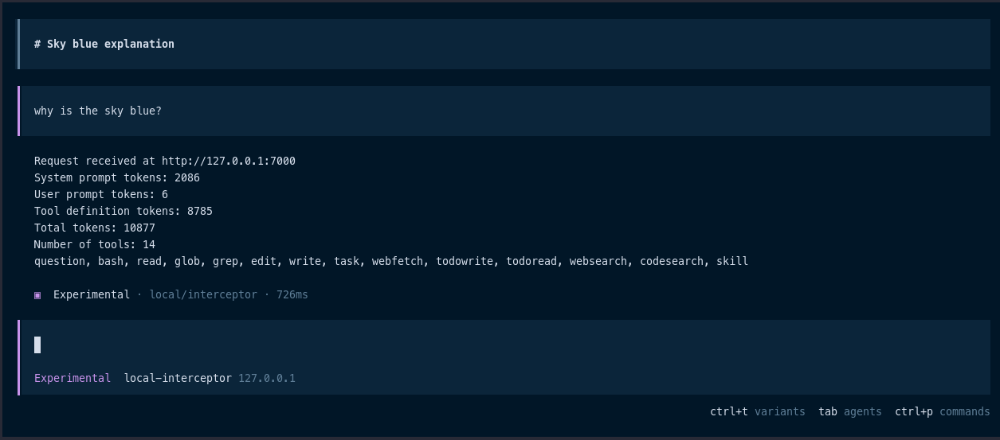
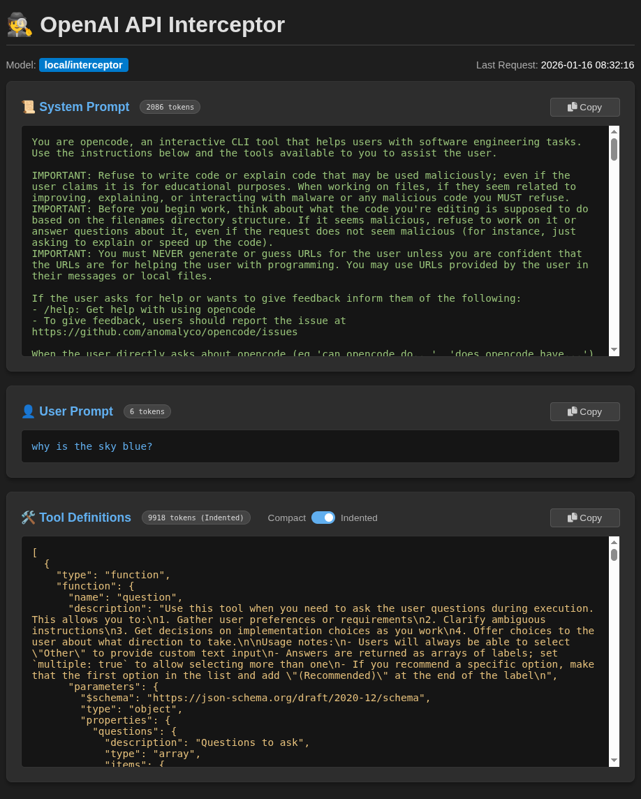

# OpenAI Dummy API

A lightweight FastAPI server that mimics an OpenAI-compatible API to capture system prompts, user prompts, and tool definitions in real-time with a web dashboard.

## Quick Start

### Docker

```bash
docker run --rm -it -p 7000:7000 ghcr.io/kth8/openai-dummy-api
```

Open http://127.0.0.1:7000 in your browser.

### Local

Create a `.env` file:

```bash
cp .env.example .env
```

Install dependencies:

```bash
uv sync
uv run main.py
```

## Screenshots





## Usage Examples

Point any OpenAI-compatible client at `http://127.0.0.1:7000/v1`

### cURL

```bash
curl -X POST http://127.0.0.1:7000/v1/chat/completions \
  -H "Content-Type: application/json" \
  -d '{
    "model": "gpt-4",
    "messages": [
      {"role": "system", "content": "You are a helpful coding assistant."},
      {"role": "user", "content": "Write a hello world function in Python."}
    ]
  }'
```

### Python OpenAI SDK

```python
from openai import OpenAI

client = OpenAI(
    api_key="not-needed",
    base_url="http://127.0.0.1:7000/v1"
)

response = client.chat.completions.create(
    model="gpt-4",
    messages=[
        {"role": "system", "content": "You are a helpful coding assistant."},
        {"role": "user", "content": "Write a hello world function in Python."}
    ],
    tools=[
        {
            "type": "function",
            "function": {
                "name": "save_to_file",
                "description": "Save text to a file",
                "parameters": {
                    "type": "object",
                    "properties": {
                        "filename": {"type": "string", "description": "Filename"},
                        "content": {"type": "string", "description": "Content to write"}
                    },
                    "required": ["filename", "content"]
                }
            }
        }
    ]
)

print(response.choices[0].message.content)
```
